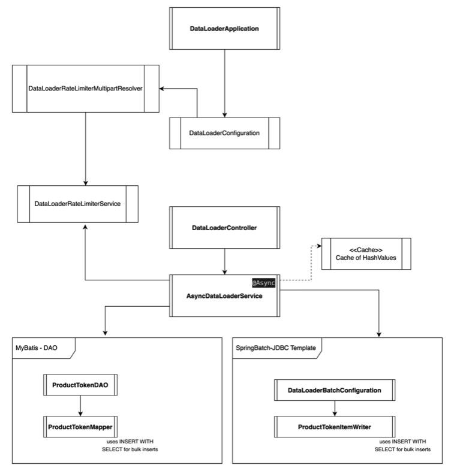

# High Volume Data Loader Use Case

TLDR:

A walkthrough on processing very large CSV uploads and database inserts in a SpringBoot application. It will also discuss the implementation of a custom multipart resolver to limit the number of file uploads, along with the incorporation of a Rate Limiter. Additionally, methods for measuring performance characteristics using Java Mission Control, SQL Server Extended Events, and Apache JMeter will be explored.

Code: [High Volume Data Loader Use Case](https://github.com/MalcolmPereira/dataloader.git) 

## High Volume Data Loader Use Case

Let us consider an existing SpringBoot web application. There is a new user story to offer API for clients to upload large CSV files containing region-specific product tokens, CSV file contain unique records that need to be added to the database. The requirement is to seamlessly integrate this feature into the existing application with minimal impact and without provisioning new services or infrastructure.

The application may be deployed as a single instance or via pods in a Kubernetes cluster. Therefore, it's essential to ensure that the new process doesn't excessively consume memory or CPU resources, potentially affecting the overall performance of the application.

Key challenges to address with this new requirement include:

- Memory Usage: Handling large files may lead to significant memory consumption, particularly if the entire file is loaded into memory at once, risking OutOfMemoryErrors if not managed properly.

- Performance: Processing large files can be CPU-intensive and time-consuming, potentially impacting the performance of other components in the application.

- Database Load: Inserting numerous records into the database simultaneously can strain the database, impacting its performance and that of any other applications using the same database.

- Concurrent Uploads: Determining the maximum number of concurrent client requests that can be handled without adversely affecting the web application's performance is crucial.

- Duplicate Records: Handling the possibility of re-uploaded CSV files containing duplicate records requires additional processing and database queries, potentially impacting performance further.

- Error Handling: Defining how to handle errors, such as badly formatted records, during file processing is essential. Decisions need to be made on whether to abort processing or ignore invalid data.

- Data Consistency: Ensuring atomicity in checking for duplicates and inserting new records is crucial, especially when multiple clients are uploading CSV files simultaneously, to prevent data inconsistencies.

It's worth noting that the process must be integrated into the existing web application, precluding the use of cloud-based data processing services, message queuing, or document-oriented databases.

The implementation of this use case will involve addressing these challenges and measuring performance characteristics to develop a matrix that guides decision-making based on observed outcomes.

## High Volume Data Loader

A high-volume data loader is a system or tool designed to import large amounts of data into a database or some other system efficiently. In a more traditional sense, data loader is an ETL(Extract, Transform, Load) process consisting of various modules executing in a sequence to extract, process or transform extracted data and finally load it to another system, preferably a database or some other system or records.

Processing large CSV files and loading the data into a database can be a resource-intensive task. The choice of implementing a high volume data loader depends on factors such as the size of the data, the complexity of the process, and the available budget for setting up the required infrastructure. Depending on these factors, various solutions can be considered, In no particular order, these may include :

- Streaming Data: Instead of loading the entire file into memory, you can stream the file and process it line by line. This allows you to handle very large files that would not fit into memory. 

- Batch Processing: Processing data in batches, rather than one record at a time, can significantly improve performance. This is especially true when writing to a database, as each write operation has a fixed overhead. A web application can save files to disk and start an asynchronous batch processing for the file.

- Parallel Processing: If the processing of each record is independent of the others, you can use parallel processing to take advantage of multiple CPU cores.

- Bulk Database Operations: Many databases support bulk insert operations, which are much faster than inserting records one at a time. 

- Message Queuing: Breaking file into smaller chunks and processing each chunk independently using a message queue (like RabbitMQ or Kafka) to manage these chunks. Each message in the queue could represent a chunk of data to be processed.

- Cloud-Based Data Processing Services: Cloud providers offer services that can process large amounts of data efficiently.

- Document Oriented Database: Frameworks like Apache Hadoop and databases like Cassandra, CouchBase, or Amazon DynamoDB can handle high write throughput, which can speed up the process of processing data.

In most cases these are over-night batch processes and run on a separate server, services and infrastructure,for the purpose of this exercise it is required this must be accommodated in the existing web application.

## Database Schema

In this use case, we utilize a simple database schema consisting of a single table to store product tokens. The existing application employs MS SQL Server 2022 as the database backend, although this could potentially be Azure SQL Database or Amazon RDS.

The product_tokens are stored as VARCHAR(MAX), we also have product_token_values_hash column which stores a checksum of the VARCHAR(MAX) column value, While this approach may not guarantee 100% accuracy akin to using SHA-256 hash, it offers improved performance for detecting duplicates.


## Key Aspects for Implementing a High Volume Data Loader in Existing SpringBoot

To successfully integrate a high volume data loader into the existing SpringBoot application, it's imperative to analyze the following aspects:

- CSV Data: Understanding the characteristics of the CSV data, including the file size, the number of records, and the size of each record, is crucial. This analysis helps in determining the optimal approach for processing the data efficiently.

- Upload Process: Evaluating the size of the data during the upload process and the size of objects in memory is essential. Efficient handling of data during the upload process minimizes memory usage and ensures smooth execution.

- Database Calls: Employing batch or bulk insert operations is vital to minimize database calls and enhance performance. Optimizing database interactions reduces latency and improves overall throughput.

- Caching: Assessing the feasibility of caching data to minimize requests to the database is important. Utilizing caching mechanisms can significantly reduce database load and enhance application responsiveness.

- Parallel Processing: Exploring the possibility of processing database inserts in parallel can help reduce the overall elapsed time for the data loading process. Parallel processing techniques enable efficient utilization of resources and expedite data processing.

- Concurrent Requests: Determining the maximum number of concurrent requests that the web application can support without adverse effects is critical. Understanding the concurrency limits ensures optimal performance and scalability under varying load conditions.

By thoroughly analyzing these aspects, we can devise a robust strategy for implementing the high volume data loader within the existing SpringBoot application, ensuring efficient data processing and minimal impact on application performance.

## CSV Data Characteristics

The UTF-8 encoded CSV file used to import product tokens into database contains the following columns: 

- code is the product code, this uniquely identifies the product
- region is the region code, this uniquely identifies the region where the product is located
- serial is the product serial number, this uniquely identifies serial number of the product within the region
- name is the token name, this is the globally unique product token
- values is the token value, this is a very json large string containing token values describing the product, token values in different region codes may be same or different.

- Example of the CSV record
```CSV
Code,Region,Serial,Name,Values
1,USA,1,Product_Token_1,"{""key1"":""value1"",""key2"":""value2....This can be very very long""}"
2,USA,2,Product_Token_2,"{""key1"":""value1"",""key2"":""value2....This can be very very long""}"
```

- File Size: The size of the file can vary, but it can be quite large, potentially in the 1 to 3 GB range.

- Record Count: The file can contain potentially 100,000 to 500,000 records.

- Size of each record: Each record is relatively small about 8 KB in size, containing a few fields, but the large number of records can add up to a large amount of data. 

Based on what we know we can roughly estimate maximum size of the data on disk and for the upload to the server.

```bash
    1 Record            =  8KB
    500,000 Records     =  8KB * 500000  = 4000000 KB  = 4GB 
```

Approx guesstimated size in memory based on [Java Object Size Estimation](https://dzone.com/articles/java-object-size-estimation-measuring-verifying), for one record of the CSV file which contain 6609 characters. 

```bash
    Size of String      = (Header    +  Hash Reference  + Char Reference)  + (Number of Characters in the String * 2 bytes) 
                        = (12 bytes  +  4 bytes         + 4 bytes )        + (6609 * 2 bytes) 
                        = (20 bytes )                                      + (13218 bytes)
                        = 13238 bytes
                        = 13.238 KB

    500,000 Records     = (13.238 KB * 500000)
                        = 6619000 KB
                        = 6459 MB
                        = 6.4 GB
```

The upload process will write file to disk temporarily until the process completes, we need to account for a dedicated shared storage mount or have enough disk space to handle the file.

For the purpose of this exercise We will use a data generator utility (datagenerator-util) that generates CSV files for testing. 


## High Volume Data Loader Design

We know this process must be asynchronous. The client uploads the file to the server, client receives an acknowledgement that the file was successfully uploaded to the server or an error response in case there are already requests being processed. The server processes the file and inserts data to the database. The server processes file asynchronously, so the client does not have to wait for the process to complete.


The simple Spring Boot application will have the usual components like Controller, Service, Repository. The Service processes the file and invokes the Repository to insert the data into the database. The Service handles asynchronous file processing. 



We have used MyBatis as the ORM framework to interact with the database. MyBatis is a simple and lightweight persistence framework that makes it easy to work with SQL databases. It provides a simple way to map Java objects to database tables and vice versa. 

We have also used Spring Batch processing as a second alternative to process the file. Spring Batch is a lightweight, comprehensive batch framework designed to enable the development of robust batch applications vital for the daily operations of enterprise systems. Spring Batch provides reusable functions that are essential in processing large volumes of records, job processing statistics, job restart and other features.

In both cases we have to keep a watch for how much memory the list of java objects is consuming as we process each record of the csv file.

We have custom multipart resolver - DataLoaderRateLimiterMultipartResolver to limit the number of file uploads which make use of  DataLoaderRateLimiterService that keep tracks of the number of concurrent requests being processed. 

### Asynchronous Processing:

The file processing is asynchronous, so the client does not have to wait for the process to complete. This is achieved using Spring's @Async annotation in AsyncDataLoaderService methods.

The Service is annotated with Async, passing in the of the task executor pool, this allows the process to execute asynchronously.

```java 
//AsyncDataLoaderService.java
@Async("AsyncExecutor")
@DataLoaderExecutionTimeLogger
@Timed(value = "processCSVFileAsync")
public void processCSVFileAsync(final File csvFile,boolean useTaskExecutor) throws DataLoaderException {
    ...
    ...
}    
```

### Streaming Data:

We are streaming file and processing it line by line, so that we can handle very large files that would not fit into memory. OpenCSV reads CSV data line by line.

```java
//AsyncDataLoaderService.java
try (
    InputStream csvFileStream = new FileInputStream(csvFile);
    CSVReader csvReader = new CSVReader(new BufferedReader(new InputStreamReader(csvFileStream, StandardCharsets.UTF_8), 1024))) {
    csvReader.readNext();
    String[] csvDataLine = csvReader.readNext();
    ...
```

### Bulk Database Operations:

We have implemented repository in such a way that it can handle bulk insert operations, which are much faster than inserting records one at a time. The MyBatis ProductTokenMapper uses INSERT with SELECT to insert records in batches keeping within the limit of SQL Server's maximum parameters of 2100. Here we are also checking for duplicates before inserting records into the database based on the checksum value.

```java
        //ProductTokenMapper.java
        String INSERT_PRODUCT_TOKEN = """
        <script>
            INSERT INTO product_tokens(product_code,region_code,product_serial,product_token_name,product_token_values,product_token_values_hash)
            SELECT V.product_code, V.region_code, V.product_serial, V.product_token_name,V.product_token_values,V.product_token_values_hash
            FROM (
                    VALUES
                    <foreach collection="productTokens" item="productToken" separator=",">
                        (
                            #{productToken.productCode},
                            #{productToken.regionCode},
                            #{productToken.productSerial},
                            #{productToken.productTokenName},
                            #{productToken.productTokenValues},
                            CHECKSUM(#{productToken.productTokenValues})
                        )
                    </foreach>
            )
            AS V(product_code, region_code, product_serial,product_token_name,product_token_values,product_token_values_hash)
            WHERE NOT EXISTS (SELECT 1 FROM product_tokens WHERE region_code = V.region_code AND product_token_values_hash = V.product_token_values_hash )
        </script>
        """;
        @Insert(INSERT_PRODUCT_TOKEN)
        @Retryable(retryFor = {SQLException.class, Exception.class})
        void insert(List<ProductToken> productTokens);  
```

However, we cannot just hammer away the database with bulk inserts especially when clients upload same files multiple times, these files are huge, we want to make sure that we only send valid inserts to the database layer and try to reduce database load, we can achieve this by maintaining a cache of checksum values on the server side and comparing them with the database before inserting new records. Another variation with checksum value calculated and maintained on server side.

```java
        //ProductTokenMapper.java
        String INSERT_PRODUCT_TOKEN_WITH_HASH = """
        <script>
            INSERT INTO product_tokens(product_code,region_code,product_serial,product_token_name,product_token_values,product_token_values_hash)
            SELECT V.product_code, V.region_code, V.product_serial, V.product_token_name,V.product_token_values,V.product_token_values_hash
            FROM (
                    VALUES
                    <foreach collection="productTokens" item="productToken" separator=",">
                        (
                            #{productToken.productCode},
                            #{productToken.regionCode},
                            #{productToken.productSerial},
                            #{productToken.productTokenName},
                            #{productToken.productTokenValues},
                            #{productToken.productTokenValuesHash}
                        )
                    </foreach>
            )
            AS V(product_code, region_code, product_serial,product_token_name,product_token_values,product_token_values_hash)
            WHERE NOT EXISTS (SELECT 1 FROM product_tokens WHERE region_code = V.region_code AND product_token_values_hash = V.product_token_values_hash )
        </script>
    """;
    @Insert(INSERT_PRODUCT_TOKEN_WITH_HASH)
    @Retryable(retryFor = {SQLException.class, Exception.class})
    void insertWithHash(List<ProductToken> productTokens);
```

### In-Memory Cache:

As mentioned above we want to maintain a cache of checksum values on server side to reduce unnecessary database calls. If clients upload the same file multiple times we want to reduce calls to the database layer.

Approx size for cache of checksum values, where each checksum value is a Long.  

```bash
        1 Long value                    = 8 bytes for long + 8 bytes for object overhead  = 16 bytes 
        
        List with 1 Long value          = 36 bytes + 4 bytes for the element for the List = 40 bytes
                                        = 16 for the long element itself                  = 16 bytes
                                        = 40 + 16 bytes                                   = 56 bytes 
       
        List with 1000000 Long values   = 20 MB 
        
        List with 5000000 Long values   = 100 MB 
```

Based on these numbers we can manage to store about 5M checksum values in an in memory cache and avoid making unnecessary calls to the database.

We use a simple CRC32 checksum to calculate the checksum value of the product token values, this is not 100% accurate but will help us in detecting duplicates fairly. If we need to be more accurate we can use SHA-256, but this will be slower. For the purpose of this exercise we will use CRC32 checksum.

The cache itself is a simple ConcurrentHashMap, which maintains a list by region code, we have keep track on when the cache was last accessed and clear it out if its not used that frequently.

There are many caching frameworks and services available, for the purpose of this implementation a simple ConcurrentHashMap works best.

```java
    //AsyncDataLoaderService
    private static final ConcurrentHashMap<String, Set<Long> > regionProductTokenMap = new ConcurrentHashMap<>();
    private static final ConcurrentHashMap<String,LocalDateTime > regionProductTokenMapAccess = new ConcurrentHashMap<>();

    //populate cache if not available
    AsyncDataLoaderService.regionProductTokenMap.compute(productToken.getRegionCode(),(key, list) ->  {
        if ( list == null ) {
            list = new HashSet<>();
            List<Long> productTokenValues = this.productTokenDAO.getProductTokensByRegionCode(productToken.getRegionCode());
            if(productTokenValues != null && !productTokenValues.isEmpty()){
                list.addAll( productTokenValues);
            }
        }
        return list;
    });

    //keep track of when the cached was last accessed by region code
    regionProductTokenMapAccess.put(productToken.getRegionCode(),LocalDateTime.now());

    //Update new cache elements as new data is written to the database
    for( Map.Entry<String,Set<Long>> entry : productTokenSet.entrySet()){
        AsyncDataLoaderService.regionProductTokenMap.compute(entry.getKey(),(key, list) ->  {
            if ( list == null ) {
                list = new HashSet<>();
            }
            list.addAll( entry.getValue());
            return list;
        });
    }        

    //clean up cache by TTL
    @Scheduled(cron = "${dataloader.cache.cleanup.cron}")
    public void cleanUpCacheByTTL() {
        logger.info( "START CACHE CLEAN UP CACHE SIZE: "+regionProductTokenMap.size()+ " ACCESS MAP SIZE: "+regionProductTokenMapAccess.size() );
        LocalDateTime lastAccessTime  = LocalDateTime.now().minusMinutes( CACHE_TTL );
        regionProductTokenMapAccess.entrySet().removeIf(entry -> {
            if (entry.getValue().isBefore(lastAccessTime)) {
                regionProductTokenMap.remove(entry.getKey());
                return true;
            }
            return false;
        });
        logger.info( "DONE CACHE CLEAN UP CACHE SIZE: "+regionProductTokenMap.size()+ " ACCESS MAP SIZE: "+regionProductTokenMapAccess.size() );
    }
```


### Parallel Execution:

Time taken by threads to complete a task depends on the nature of the task and the system's resources. If the task is CPU-bound and there are enough CPU cores to run the threads in parallel, then adding more threads can decrease the total time taken. However, if the task is I/O-bound or there aren't enough CPU cores to run the threads in parallel, then adding more threads might not decrease the total time taken and could even increase it due to the overhead of context switching. 

Increasing the number of threads can potentially improve the performance of writing to a database, but it depends on several factors:

- Database Write Capacity: If your database can handle multiple write operations concurrently, then using more threads can improve performance. However, if your database is already at its write capacity, adding more threads might not help and could even degrade performance.

- Network Latency: If your application is waiting for network responses from the database, using more threads can help because while one thread is waiting for a response, another thread can be sending a request.

- Hardware Resources: If your server has enough CPU cores and memory to handle more threads, then using more threads can improve performance. However, if your server is already at its resource limits, adding more threads might not help and could even degrade performance.

- Finally, There's a limit to how much performance can be improved by adding more threads. At a certain point, overhead of managing threads and the contention for resources can cause performance to degrade. 

We use ThreadPoolTaskExecutor bean to process the file asynchronously, allowing us to leverage multiple CPU cores for parallel file processing. 

The DataLoaderApplication defines ThreadPoolTaskExecutor for executing batches in parallel, we will see later from the performance measurements that to support multiple parallel inserts to the database, the database must be of an appropriate size.

How do we find the optimal pool size though ?  [Thread Pool](https://en.wikipedia.org/wiki/Thread_pool) [Thread Pool Tunning](https://www.infoq.com/articles/Java-Thread-Pool-Performance-Tuning/) talk about the various concepts and validations. [BrianGoetz](https://inside.java/u/BrianGoetz/) in his classic book [Java Concurrency in Practice](https://www.amazon.com/Java-Concurrency-Practice-Brian-Goetz/dp/0321349601) talks about optimal pool size which boils down to.

```bash
    optimal pool size = N * U * (1 + W/C)

    N - Number of CPU cores
    U - Target CPU Utilization
    W - Wait Time
    C - Compute Time
```

We configure the pool size for parallel tasks accordingly.

```java
    //DataLoaderApplication.java
    long availableProcessors = Runtime.getRuntime().availableProcessors();
    Math.ceil(availableProcessors * targetCPUUtilizationDouble * (1 + (double) targetCPUWaitTime / targetCPUComputeTime));

    @Bean(name = "BatchTaskExecutor", destroyMethod = "shutdown")
    public ThreadPoolTaskExecutor batchTaskExecutor(Environment env) {
	}
```

### Concurrent Requests and Rate Limiting:

We want to limit the number of data loader requests being performed concurrently, we can use a simple semaphore that simply counts request and  limits number of concurrent requests.

```java
    //DataLoaderRateLimiterService.java

    AtomicInteger requestCounter = new AtomicInteger(this.maxRequest);

    //Increment the request counter
    public boolean canProcessUploads() {
        try{
            lock.lock();
            if( this.requestCounter.get() > 0){
                this.requestCounter.decrementAndGet();
                return true;
            }
            return false;
        }finally {
            lock.unlock();
        }
    }

    //Decrement the request counter
    public void resetRequestCounts() {
        try{
            lock.lock();
            if( this.requestCounter.get() < this.maxRequest){
                this.requestCounter.incrementAndGet();
            }
        }finally {
            lock.unlock();
        }
    }
```

If there are already concurrent requests being processed, the client will receive a 429 status code, this will help us to limit the number of concurrent requests being processed and not impact the web application.

But where do we inject this Rate Limiter, Spring MultipartFile/MultipartFileResolver will process uploaded file into memory/temporary location   before the request comes to the Controller, by this time it's too late, client has already uploaded the file to the server and we have wasted valuable CPU cycles and memory only to tell the client that we cannot process the file. 

We have to use a custom MultipartResolver to limit the number of file uploads, this was achieved by extending the StandardServletMultipartResolver and overriding the resolveMultipart method to check if the rate limiter allows the request to be processed.

```java
    //DataLoaderRateLimiterMultipartResolver.java
    @Override
	public @NonNull MultipartHttpServletRequest resolveMultipart( HttpServletRequest request) throws MultipartException {
		if (request.getRequestURI() !=null && request.getRequestURI().contains("upload") && !this.dataLoaderRateLimiterService.canProcessUploads()){
			logger.info( "FILE UPLOAD NOT QUEUED - Rate limit exceeded for uploads CURRENT COUNTS: " +this.dataLoaderRateLimiterService.currentRequestCounts());
			throw new MultipartException("Rate limit exceeded");
		}
		logger.info( "FILE UPLOAD QUEUED CURRENT PROCESS COUNT: " +this.dataLoaderRateLimiterService.currentRequestCounts());
		return super.resolveMultipart(request);
	}

    //DataLoaderMultiPartExceptionHandler.java
    @ResponseBody
	@ResponseStatus(HttpStatus.TOO_MANY_REQUESTS)
	@ExceptionHandler( MultipartException.class)
	public ResponseEntity<DataLoaderResponse>  handleMultipartException( MultipartException err) {
		logger.error( "Multipart Exception: "+err.getMessage());
		final DataLoaderResponse response = new DataLoaderResponse();
		response.setErrorCode(429);
		response.setErrorMessage("Too many requests in progress, please try later");
		return new ResponseEntity<>(response, HttpStatus.TOO_MANY_REQUESTS);
	}
```


### Configuration Switches:

Key configuration switches in the design are:

- Maximum Database Connection Pool Size: 
  With [HikariCP](https://github.com/brettwooldridge/HikariCP) as the connection pool, we have control over the maximum number of connections to the database, this can be increased, to handle the load of the data loader process. Ideally, we aim to minimize the number of connections to avoid overloading the database. Having many connections can lead to contention and performance issues.

  We configure SQL Server specific attributes on the JDBC connection string which includes queryTimeout, connectRetryInterval, connectRetryCount, cancelQueryTimeout, and socketTimeout. The socketTimeout attribute sets the timeout for the database connection. If the database does not respond within this time, the connection is terminated to prevent the application from hanging. We do not want the HikariCP to keep waiting for the database to respond.
  
- Batch Size:
  We can control the batch size of the records to be inserted into the database. Since this implementation utilizes INSERT WITH SELECT, there is a limit to the number of parameters that can be passed to the database, for example, in the case of SQL Server this limit is 2100. Since we are inserting a large VARCHAR(max) column, we have set the batch size to 250 records. Another issue is keeping objects in memory we do not want to hold a large pool of objects in memory for a long time.

- Max Requests:
  Maximum concurrent requests that can be processed this is to limit the number of concurrent requests being processed.

- Cache Time to Live:
  How long we want to keep the cached checksum values is memory before they are evicted.
  We also have a scheduled task to clean up the cache.

- Thread Pool Side Configurations:
  We set target CPU utilization, wait time and process time so the size of the thread pool can be calculated.

```bash
    //application.properties
    spring.datasource.hikari.maximum-pool-size=25
    
    dataloader.batch.size=250
    dataloader.max.requests=5
    dataloader.cache.ttl=180
    dataloader.cache.cleanup.cron=0 0 * * * *
    dataloader.cpu.utilization=0.80
    dataloader.cpu.wait.time=5000
    dataloader.cpu.process.time=360
```

### REST End Points: 

We have the following REST endpoints in the application which we will use to measure performance data.


1. Sequential 

    Simple Upload and process CSV file asynchronously in a sequential manner, i.e. records are read line by line when set batch size is reached, call the MyBatis DAO to insert to database. 

2. Parallel

    Submit batches to a task executor instead of processing sequentially, this will cause CPU spikes and increased memory usage as database calls are made by multiple threads.

3. Sequential - Cache

    Same as sequential process except cache of checksum values is maintained on server side to reduce unnecessary database calls.

4. Parallel - Cache

    Similar to parallel process except cache of checksum values is maintained on server side to reduce unnecessary database calls.

5. Spring Batch

    Simple Spring Batch process invoked from the application, this processes file sequentially and sends chunks of accumulated records to be inserted to the database. This should have similar performance characteristics as the sequential process.

## Measuring Performance

We will use following tools to measure performance of the data loader process:

### [Java Mission Control](https://www.oracle.com/java/technologies/jdk-mission-control.html) 

Java Mission Control is a tool for monitoring and managing Java applications. It is used to monitor the JVM memory usage, CPU usage, and garbage collection activity. We need to monitor the JVM memory usage to ensure that the process does not consume too much memory and CPU usage. We expect to see high Socket IO and File IO activity as the file is being processed and written to the database.

### [SQL Server Extended Events](https://learn.microsoft.com/en-us/sql/relational-databases/extended-events/extended-events) 

We will use SQL Server Extended Events to monitor the database performance, including the number of connections, the number of queries, and the query execution time. Here we want to check CPU Duration, Reads/Writes and Duration of the queries.

The captured events consist of the following:

- cpu_time: Typically measured in microseconds (μs). This represents the amount of CPU time consumed by the event.

- duration: Usually measured in microseconds (μs) as well. This represents the duration of the event.

- logical reads: Represents the number of logical reads performed by the event. Again, this is a count rather than a time-based measurement. Having higher logical reads is better than having higher physical reads.

- physical reads: Represents the number of physical reads performed by the event. Similar to logical reads, this is a count rather than a time-based measurement.  

- writes: Represents the number of writes performed by the event. This is a count rather than a time-based measurement.

### [Apache JMeter](https://jmeter.apache.org/) 

Apache JMeter allows us to put load on the server and validate server characteristics with concurrent requests, we will use this to determine how many uploads can be support and do we need to take any actions to limit uploads.

Additionally, we measure the elapsed time to process the file by logging in the Spring Application. This logging tells us how long it took to process the file. 

We will measure data for a single transaction i.e a single API call, later on we will measure with concurrent calls using Apache JMeter.

We will measure the performance of data loader process using just a large file (500K Records) and following settings. 

|                                |                      |
|----                            |----                  |
|Java Version                    |17.0.10 2024-01-16 LTS|
|Spring Boot                     |v3.2.2                |
|Spring                          |6.1.3                 |
|Spring Batch                    |5.1.0                 |
|MSSQL JDBC Driver               |12.6.0jre11           |
|SQL Server                      |2022                  |

|                                |           |
|----                            |----       |
|Database Connection Pool Size   |25         |
|Batch Size                      |250 or 150 |
|JVM Heap Size                   |1024 MB    |
|JVM CPU                         |2          |
|Garbage Collection              |GCG1       |

|                                   |           |
|----                               |----       |
|Remote Database - SQL Server 2022  |Window Server 2022 4GB  /  2 CPU Core  |


## Performance Data Summary:

Please note these number may seem high and not truly representative of a production environment. We have run these test 3 times to make sure values are in same range. This will help us to understand how the process behaves. 

JVM Metrics - Memory and CPU reflects max usage during profiling period, we want to consume less memory and cpu. 

SQL Server Metrics reflect transactions with max cpu_time, duration, logical/physical reads and writes, we want to minimize cpu time and duration, we want to also minimize logical reads i.e. not reading more data than required into buffer and minimize physical reads i.e. avoid physical reads from disk. When database write capacity exhausts, we will see increased duration and cpu time.

We are also checking if there is data loss due to deadlocks on the database, Retryable annotation on the MyBatis Mapper will retry insert operation in case of a deadlock, we however want to check there is no data loss. During testing there was no data loss however deadlock errors were observed for parallel tests.

For Caching based operation, we validated with and without cache data being populated, the Re-Post tests executed after cache was populated, we can see significant improvement in elapsed time and database metrics since we are not making unnecessary database calls.

| Implementation                 |Batch Size|Thread Pool Size|Elapsed Time <br/> Minutes |JVM Memory <br/> MB | JVM CPU       |Max <br/>SQL Server CPU     |Max <br/>SQL Server Duration   |Max <br/>Logical Reads |Max <br/>Physical Reads | Max Writes|Deadlock Errors| 
| --------                       |--------  |--------        |--------                   |--------            |--------       |--------                    |--------                       |--------               |--------                |--------   |--------       |
|Sequential                      |250       |-               |18.25                      |106                 |32.1 %         |1360000μs<br/>1360ms<br/>1s |1376459μs<br/>1376ms<br/>1s    |40581                  |1                       |2121       |No             |
|Sequential                      |150       |-               |20.55                      |105                 |27.3 %         |1172000μs<br/>1172ms<br/>1s |1163738μs<br/>1163ms<br/>1s    |26299                  |30                      |1235       |No             |
|Parallel                        |250       |24              |22.39                      |406                 |61 %           |1250000μs<br/>1250ms<br/>1s |30316006μs<br/>30316ms<br/>30s |16342                  |1704                    |573        |Yes            |
|Parallel                        |250       |4               |36.16                      |342                 |45.7 %         |1219000μs<br/>1219ms<br/>1s |13404981μs<br/>13404ms<br/>13s |15020                  |1728                    |572        |Yes            |
|Parallel                        |150       |24              |34.41                      |500                 |70.8 %         |1062000μs<br/>1062ms<br/>1s |29964624μs<br/>29964ms<br/>30s |11422                  |1504                    |381        |Yes            |
|Parallel                        |150       |4               |20.78                      |235                 |46.3 %         |1141000μs<br/>1141ms<br/>1s |10268168μs<br/>10268ms<br/>10s |26222                  |2                       |1224       |Yes            |
|Sequential-Cache                |250       |-               |18.78                      |109                 |29.5 %         |1062000μs<br/>1062ms<br/>1s |29964624μs<br/>29964ms<br/>30s |11422                  |1504                    |381        |No             |
|Sequential-Cache<br/> (Re-Post) |250       |-               |2.57                       |150                 |25.7 %         |188000μs<br/>188ms<br/>0.2s |179771μs<br/>179ms<br/>0.2s    |2478                   |0                       |0          |No             |
|Parallel-Cache                  |250       |24              |25.12                      |702                 |44.6 %         |1235000μs<br/>1235ms<br/>1s |22008795μs<br/>22008ms<br/>22s |7804                   |1481                    |333        |Yes            |
|Parallel-Cache<br/> (Re-Post)   |250       |24              |2.45                       |211                 |36.3 %         |188000μs<br/>188ms<br/>0.2s |175824μs<br/>175ms<br/>0.2s    |2478                   |0                       |0          |No             |
|Spring-Batch                    |250       |-               |19                         |102                 |33.1 %         |1422000μs<br/>1422ms<br/>1s |1435812μs<br/>1435ms<br/>1s    |40419                  |1                       |2083       |No             |
|Spring-Batch                    |150       |-               |21.43                      |95.9                |27.4 %         |1078000μs<br/>1078ms<br/>1s |1116473μs<br/>1116ms<br/>1s    |25877                  |1                       |1244       |No             |

**Please see Appendix section for details about these measurements. 


### Elapsed Time:

We can clearly see parallelizing aggressively results in longer elapsed time, more over higher risk of data loss. This is because of lock contentions at the database layer, resulting in deadlocks and connection staying active for a longer times. If there was larger more powerful database, we could have seen better performance with parallelization.

The decision to parallelize should be based on the capacity of the database to handle concurrent sessions, the size of the existing data in the table, the batch size, and the number of threads, in the case of this database the parallelization did not help and in fact slowed down the process.


We see the following error in the logs when there are deadlocks. The Retryable annotations will retry transactions three times, however it may fail to insert the data if all three attempts fail, during our tests we did not see any data loss, but we did see deadlocks.

```bash
### Cause: com.microsoft.sqlserver.jdbc.SQLServerException: Transaction (Process ID 66) was deadlocked on lock resources with another process and has been chosen as the deadlock victim. Rerun the transaction.
; Transaction (Process ID 66) was deadlocked on lock resources with another process and has been chosen as the deadlock victim. Rerun the transaction.

[WARN ],[2024-02-24T18:30:01.676-0500],[148],[Batch-Executor5],[com.zaxxer.hikari.pool.ProxyConnection],HikariPool-1 - Connection ConnectionID:5 ClientConnectionId: 571c5513-7382-4821-9839-79b2b118d7f7 marked as broken because of SQLSTATE(08S01), ErrorCode(0),
com.microsoft.sqlserver.jdbc.SQLServerException: Read timed out

[WARN ],[2024-02-24T18:31:31.170-0500],[171],[mssql-timeout-task-1-21b87896-7b2b-49e5-b5bc-bb9b07f19b5e],[com.microsoft.sqlserver.jdbc.internals.TDS.Command],TDSCommand@6150b9f4 (sp_executesql SQL: null executeXXX): Command could not be timed out. Reason: Socket closed,

```

Sequential tasks with and without caching offered better performance, with caching we saw significant improvement in elapsed time and database metrics.


### JVM - Memory and CPU:

Again as we parallelize aggressively we see increased memory usage and cpu which is expected, more threads processing batches in parallel which hold more objects in memory.


### SQL Server:

Smaller batch sizes seem to have better cpu_time and duration on the SQL Server, with multiple threads hitting the database concurrently the cpu_time and duration increases which is expected. When the hardware supports it, parallelizing database operations can improve performance, but it depends on several factors, as mentioned earlier.


We come to conclusion than on this environment, sequential processing with caching is the best approach, we will now test with Apache JMeter to see how many concurrent uploads can be supported and if we need to take any actions to limit uploads.

## Performance Data Summary Concurrent Requests:

JMeter tests conducted with files containing 25K record, which takes about 3 minutes to complete when processed sequentially, each thread uses a unique file with unique records.

We see the database starts to slow down and there is overall increase in the elapsed time, memory, cpu and dead lock errors with concurrent requests, utilizing a rate limiter helps stabilize the process.


| Implementation                 |Batch Size|Thread Pool Size|Elapsed Time <br/> Minutes |JVM Memory <br/> MB | JVM CPU       |Max <br/>SQL Server CPU     |Max <br/>SQL Server Duration   |Max <br/>Logical Reads |Max <br/>Physical Reads | Max Writes|Deadlock Errors| 
| --------                       |--------  |--------        |--------                   |--------            |--------       |--------                    |--------                       |--------               |--------                |--------   |--------       |
|Sequential-Cache                |250       |-               |12                         |750                 |64.1 %         |1437000μs<br/>1437ms<br/>1s |7380177μs<br/>7380ms<br/>7s    |34545                  |5                       |2071       |Ye             |
|Sequential-Cache (Rate Limit 5) |250       |-               |4.18                       |413                 |58.1 %         | 844000μs<br/>844ms<br/>0.8s|5435101μs<br/>5435ms<br/>5s    |24806                  |53                      |1560       |No             |

**Please see Appendix section for details about these measurements. 

### Elapsed Time:

We can see concurrent requests slow down the process, using a fixed number of concurrent requests improves overall elapsed time. There is impact to the clients where they have to retry requests when they receive 429 status code, but this is better than the server being overwhelmed and not being able to process requests. 


### JVM - Memory and CPU:

Limiting number of concurrent requests helps stabilize the memory and cpu usage.


### SQL Server:

We see better duration and cpu time when we reduce number of concurrent requests on the database.


### Conclusion:

Sequential processing with caching and limiting concurrent requests is the best option in this system based on the performance data we gathered.

Lessons learned from this exercise:

- Batch calls to the database, bulk inserts, and bulk updates are much faster than single-record inserts. This is true for both MyBatis and Spring JDBC Template.

- Sequential calls offer better performance than parallel calls, especially when dealing with a database which does not support high concurrent write capacity. 

- Using caching to minimize database calls can significantly improve performance especially when dealing with large datasets which can contain duplicate records.

- Use a rate limiter to limit the number of concurrent requests being processed, this will help stabilize the process and avoid overwhelming the server.

- Keep using tools like Java Profilers and SQL Server Profiler to monitor the performance of the JVM and SQL Server. This will help us identify performance bottlenecks and optimize the process.


Hope this information helps you to understand how to measure performance of a data loader process and how to optimize it.


## Appendix :


### 1. Sequential [Batch Size 250]

With sequential processing, records are read one at a time until the desired batch size is met, and one JDBC call is made to the database for that batch. So, we have 2000 JDBC calls made to the database for 500K records, i.e., 60% less DB hits.

#### Total Elapsed Time : 18.25 minutes

#### JVM Profiling: 

| Metric                    | Value               | 
| --------                  | --------            |
| JVM Heap Memory Used      | 106 MB              |
| JVM CPU                   | 32.1%               |

![Sequential [Batch Size 250] JVM Stats](readme-assets/dataloader-sequential-250-jvm-metrics.png)

![Sequential [Batch Size 250] JVM Memory](readme-assets/dataloader-sequential-250-jvm-metrics-memory.png)

![Sequential [Batch Size 250] IO](readme-assets/dataloader-sequential-250-jvm-metrics-io.png)

#### SQL Server Profiling: 

| Metric                    | Value                          | 
| --------                  | --------                       |
| Max CPU Time              | 1360000μs   1360ms  1s         |
| Max Duration              | 1376459μs   1376ms  1s         |
| Max Logical Reads         | 40581                          |
| Max Physical Reads        | 1                              |
| Max Writes                | 2121                           |

![Sequential [Batch Size 250] SQL Profiler](readme-assets/dataloader-sequential-250-profiler-metrics.png)


### 2. Sequential [Batch Size 150]

With a smaller batch size, we see a slight increase in elapsed time, but the JVM memory and CPU usage almost similar.

#### Total Elapsed Time : 20.55 minutes

#### JVM Profiling: 

| Metric                    | Value               | 
| --------                  | --------            |
| JVM Heap Memory Used      | 105 MB              |
| JVM CPU                   | 27.3%               |

![Sequential [Batch Size 250] JVM Stats](readme-assets/dataloader-sequential-150-jvm-metrics.png)

![Sequential [Batch Size 250] JVM Memory](readme-assets/dataloader-sequential-150-jvm-metrics-memory.png)

![Sequential [Batch Size 250] IO](readme-assets/dataloader-sequential-150-jvm-metrics-io.png)

#### SQL Server Profiling: 

| Metric                    | Value                          | 
| --------                  | --------                       |
| Max CPU Time              | 1172000μs  1172ms  1s          |
| Max Duration              | 1163738μs  1163ms  1s          |
| Max Logical Reads         | 26299                          |
| Max Physical Reads        | 30                             |
| Max Writes                | 1235                           |

![Sequential [Batch Size 250] SQL Profiler](readme-assets/dataloader-sequential-150-profiler-metrics.png)

### 3. Parallel [Batch Size 250] [Thread Pool Size 24]

With aggressive parallelization we see increase in memory and cpu and overall increase in elapsed time.

#### Total Elapsed Time : 22.39 minutes

#### JVM Profiling: 

| Metric                    | Value               | 
| --------                  | --------            |
| JVM Heap Memory Used      | 406 MB              |
| JVM CPU                   | 61 %                |

![Sequential [Batch Size 250] JVM Stats](readme-assets/dataloader-parallel-250-24-jvm-metrics.png)

![Sequential [Batch Size 250] JVM Memory](readme-assets/dataloader-parallel-250-24-jvm-metrics-memory.png)

![Sequential [Batch Size 250] IO](readme-assets/dataloader-parallel-250-24-jvm-metrics-io.png)

#### SQL Server Profiling: 

| Metric                    | Value                          | 
| --------                  | --------                       |
| Max CPU Time              | 1250000μs  1250ms  1s          |
| Max Duration              | 30316006μs 30316ms 30s         |
| Max Logical Reads         | 16342                          |
| Max Physical Reads        | 1704                           |
| Max Writes                | 573                            |

![Sequential [Batch Size 250] SQL Profiler](readme-assets/dataloader-parallel-250-24-profiler-metrics.png)


### 4. Parallel [Batch Size 250] [Thread Pool Size 4]

With lesser number of thread execution elapsed time increases, however we see decrease in memory and cpu usage.

#### Total Elapsed Time : 36.16 minutes

#### JVM Profiling: 

| Metric                    | Value               | 
| --------                  | --------            |
| JVM Heap Memory Used      | 342 MB              |
| JVM CPU                   | 45.7 %              |

![Sequential [Batch Size 250] JVM Stats](readme-assets/dataloader-parallel-250-4-jvm-metrics.png)

![Sequential [Batch Size 250] JVM Memory](readme-assets/dataloader-parallel-250-4-jvm-metrics-memory.png)

![Sequential [Batch Size 250] IO](readme-assets/dataloader-parallel-250-4-jvm-metrics-io.png)

#### SQL Server Profiling: 

| Metric                    | Value                          | 
| --------                  | --------                       |
| Max CPU Time              | 1219000μs  1219ms  1s          |
| Max Duration              | 13404981μs 	13404ms 13s      |
| Max Logical Reads         | 15020                          |
| Max Physical Reads        | 1728                           |
| Max Writes                | 572                            |

![Sequential [Batch Size 250] SQL Profiler](readme-assets/dataloader-parallel-250-4-profiler-metrics.png)

### 5. Parallel [Batch Size 150] [Thread Pool Size 24]

With a smaller batch size and more number of threads we clearly see the load on the database exhausting its write capacity, this is evident from the increased memory and cpu usage and increased duration and cpu time on the database.

#### Total Elapsed Time : 34.41 minutes

#### JVM Profiling: 

| Metric                    | Value               | 
| --------                  | --------            |
| JVM Heap Memory Used      | 500 MB              |
| JVM CPU                   | 70.8 %              |

![Sequential [Batch Size 250] JVM Stats](readme-assets/dataloader-parallel-150-24-jvm-metrics.png)

![Sequential [Batch Size 250] JVM Memory](readme-assets/dataloader-parallel-150-24-jvm-metrics-memory.png)

![Sequential [Batch Size 250] IO](readme-assets/dataloader-parallel-150-24-jvm-metrics-io.png)

#### SQL Server Profiling: 

| Metric                    | Value                          | 
| --------                  | --------                       |
| Max CPU Time              | 1062000μs  1062ms  1s          |
| Max Duration              | 29964624μs 29964ms 30s         |
| Max Logical Reads         | 11422                          |
| Max Physical Reads        | 1504                           |
| Max Writes                | 381                            |

![Sequential [Batch Size 250] SQL Profiler](readme-assets/dataloader-parallel-150-24-profiler-metrics.png)

### 6. Parallel [Batch Size 150] [Thread Pool Size 4]

With a smaller batch size and smaller threads pool we see better performance.

#### Total Elapsed Time : 20.78 minutes

#### JVM Profiling: 

| Metric                    | Value               | 
| --------                  | --------            |
| JVM Heap Memory Used      | 235 MB              |
| JVM CPU                   | 46.3 %              |

![Sequential [Batch Size 250] JVM Stats](readme-assets/dataloader-parallel-150-4-jvm-metrics.png)

![Sequential [Batch Size 250] JVM Memory](readme-assets/dataloader-parallel-150-4-jvm-metrics-memory.png)

![Sequential [Batch Size 250] IO](readme-assets/dataloader-parallel-150-4-jvm-metrics-io.png)

#### SQL Server Profiling: 

| Metric                    | Value                          | 
| --------                  | --------                       |
| Max CPU Time              | 1141000μs 1141ms 1s            |
| Max Duration              | 10268168μs 10268ms 10s         |
| Max Logical Reads         | 26222                          |
| Max Physical Reads        | 2                              |
| Max Writes                | 1224                           |

![Sequential [Batch Size 250] SQL Profiler](readme-assets/dataloader-parallel-150-4-profiler-metrics.png)


### 7. Sequential-Caching [Batch Size 250]

This has similar performance characteristics as the sequential process, however we see significant improvement in elapsed time and database metrics when we are not making unnecessary database calls. 

#### Total Elapsed Time : 18.78 minutes

#### JVM Profiling: 

| Metric                    | Value               | 
| --------                  | --------            |
| JVM Heap Memory Used      | 109 MB              |
| JVM CPU                   | 29.5 %              |

![Sequential [Batch Size 250] JVM Stats](readme-assets/dataloader-sequential-cache-250-jvm-metrics.png)

![Sequential [Batch Size 250] JVM Memory](readme-assets/dataloader-sequential-cache-250-jvm-metrics-memory.png)

![Sequential [Batch Size 250] IO](readme-assets/dataloader-sequential-cache-250-jvm-metrics-io.png)

#### SQL Server Profiling: 

| Metric                    | Value                          | 
| --------                  | --------                       |
| Max CPU Time              | 1062000μs   1062ms  1s         |
| Max Duration              | 29964624μs  29964ms  30s       |
| Max Logical Reads         | 11422                          |
| Max Physical Reads        | 1504                           |
| Max Writes                | 381                            |

![Sequential [Batch Size 250] SQL Profiler](readme-assets/dataloader-sequential-cache-250-profiler-metrics.png)


### 8. Sequential-Caching (Re-Post) [Batch Size 250]

With data already cache, not calls are made to the database, the overall cache overhead is not significant.

#### Total Elapsed Time : 2.57 minutes

#### JVM Profiling: 

| Metric                    | Value               | 
| --------                  | --------            |
| JVM Heap Memory Used      | 150 MB              |
| JVM CPU                   | 25.7 %              |

![Sequential [Batch Size 250] JVM Stats](readme-assets/dataloader-sequential-cache-2-250-jvm-metrics.png)

![Sequential [Batch Size 250] JVM Memory](readme-assets/dataloader-sequential-cache-2-250-jvm-metrics-memory.png)

![Sequential [Batch Size 250] IO](readme-assets/dataloader-sequential-cache-2-250-jvm-metrics-io.png)

#### SQL Server Profiling: 

| Metric                    | Value                          | 
| --------                  | --------                       |
| Max CPU Time              | 188000μs   188ms  0.2s         |
| Max Duration              | 179771μs   179ms  0.2s         |
| Max Logical Reads         | 2478                           |
| Max Physical Reads        | 0                              |
| Max Writes                | 0                              |

![Sequential [Batch Size 250] SQL Profiler](readme-assets/dataloader-sequential-cache-2-250-profiler-metrics.png)


### 9. Parallel-Caching [Batch Size 250] [Thread Pool Size 24]

This has similar performance characteristics as the parallel process with a slight overhead of memory due to the cache, however we see significant improvement in elapsed time and database metrics when we are not making unnecessary database calls based on cached data.

#### Total Elapsed Time : 25.12 minutes

#### JVM Profiling: 

| Metric                    | Value               | 
| --------                  | --------            |
| JVM Heap Memory Used      | 702 MB              |
| JVM CPU                   | 44.6 %              |

![Sequential [Batch Size 250] JVM Stats](readme-assets/dataloader-parallel-cache-250-jvm-metrics.png)

![Sequential [Batch Size 250] JVM Memory](readme-assets/dataloader-parallel-cache-250-jvm-metrics-memory.png)

![Sequential [Batch Size 250] IO](readme-assets/dataloader-parallel-cache-250-jvm-metrics-io.png)

#### SQL Server Profiling: 

| Metric                    | Value                          | 
| --------                  | --------                       |
| Max CPU Time              | 1235000μs   1235ms  1s         |
| Max Duration              | 22008795μs   22008ms  22s      |
| Max Logical Reads         | 7804                           |
| Max Physical Reads        | 1481                           |
| Max Writes                | 333                            |

![Sequential [Batch Size 250] SQL Profiler](readme-assets/dataloader-parallel-cache-250-profiler-metrics.png)


### 10. Parallel-Caching (Re-Post) [Batch Size 250] [Thread Pool Size 24]

With data already cache, not calls are made to the database, the overall cache overhead is not significant.


#### Total Elapsed Time : 2.45 minutes

#### JVM Profiling: 

| Metric                    | Value               | 
| --------                  | --------            |
| JVM Heap Memory Used      | 211 MB              |
| JVM CPU                   | 36.3 %              |

![Sequential [Batch Size 250] JVM Stats](readme-assets/dataloader-parallel-cache-2-250-jvm-metrics.png)

![Sequential [Batch Size 250] JVM Memory](readme-assets/dataloader-parallel-cache-2-250-jvm-metrics-memory.png)

![Sequential [Batch Size 250] IO](readme-assets/dataloader-parallel-cache-2-250-jvm-metrics-io.png)

#### SQL Server Profiling: 

| Metric                    | Value                          | 
| --------                  | --------                       |
| Max CPU Time              | 188000μs   188ms  0.2s         |
| Max Duration              | 175824μs   175ms  0.2s         |
| Max Logical Reads         | 2478                           |
| Max Physical Reads        | 0                              |
| Max Writes                | 0                              |

![Sequential [Batch Size 250] SQL Profiler](readme-assets/dataloader-parallel-cache-2-250-profiler-metrics.png)


### 11. Spring Batch [Batch Size 250]

Similar to the sequential process, we see similar performance characteristics with Spring Batch.

#### Total Elapsed Time : 19 minutes

#### JVM Profiling: 

| Metric                    | Value               | 
| --------                  | --------            |
| JVM Heap Memory Used      | 102 MB              |
| JVM CPU                   | 33.1 %              |

![Sequential [Batch Size 250] JVM Stats](readme-assets/dataloader-batch-250-jvm-metrics.png)

![Sequential [Batch Size 250] JVM Memory](readme-assets/dataloader-batch-250-jvm-metrics-memory.png)

![Sequential [Batch Size 250] IO](readme-assets/dataloader-batch-250-jvm-metrics-io.png)

#### SQL Server Profiling: 

| Metric                    | Value                          | 
| --------                  | --------                       |
| Max CPU Time              | 1422000μs  1422ms 1s           |
| Max Duration              | 1435812μs  1435ms 1s           |
| Max Logical Reads         | 40419                          |
| Max Physical Reads        | 1                              |
| Max Writes                | 2083                             |

![Sequential [Batch Size 250] SQL Profiler](readme-assets/dataloader-batch-250-profiler-metrics.png)

### 12. Spring Batch [Batch Size 150]

With a reduced batch size, we see a slight increase in elapsed time, but the JVM memory and CPU usage almost similar.

#### Total Elapsed Time : 21.43 minutes

#### JVM Profiling: 

| Metric                    | Value               | 
| --------                  | --------            |
| JVM Heap Memory Used      | 95.9 MB             |
| JVM CPU                   | 27.4 %              |

![Sequential [Batch Size 250] JVM Stats](readme-assets/dataloader-batch-150-jvm-metrics.png)

![Sequential [Batch Size 250] JVM Memory](readme-assets/dataloader-batch-150-jvm-metrics-memory.png)

![Sequential [Batch Size 250] IO](readme-assets/dataloader-batch-150-jvm-metrics-io.png)

#### SQL Server Profiling: 

| Metric                    | Value                          | 
| --------                  | --------                       |
| Max CPU Time              | 1078000μs  1078ms  1s          |
| Max Duration              | 1116473μs  1116ms  1s          |
| Max Logical Reads         | 25877                          |
| Max Physical Reads        | 1                              |
| Max Writes                | 1244                           |

![Sequential [Batch Size 250] SQL Profiler](readme-assets/dataloader-batch-150-profiler-metrics.png)


### 13. JMeter Sequential With Cache [25 Concurrent Requests]  

JMeter tests conducted with files containing 25K record, which takes about 3 minutes to complete when processed sequentially, however when we increase the number of concurrent requests to 25, the database starts to slow down and there is overall increase in the elapsed time, high memory usage and deadlocks being observed.

#### Average Elapsed Time Client Uploads : 1.71 minute

![JMeter [25] Tests](readme-assets/dataloader-sequential-cache-jmeter-25-jmeter-tests.png)

![JMeter [25] Summary](readme-assets/dataloader-sequential-cache-jmeter-25-jmeter-summary.png)


#### Average Elapsed Time Server Processing: 12 minutes
	
| Metric                    | Value               | 
| --------                  | --------            |
| JVM Heap Memory Used      | 750 MB              |
| JVM CPU                   | 64.1 %              |

![JMeter [25] JVM Stats](readme-assets/dataloader-sequential-cache-jmeter-25-jvm-metrics.png)

![JMeter [25] JVM Memory](readme-assets/dataloader-sequential-cache-jmeter-25-jvm-metrics-memory.png)

![JMeter [25] IO](readme-assets/dataloader-sequential-cache-jmeter-25-jvm-metrics-io.png)

#### SQL Server Profiling: 

| Metric                    | Value                          | 
| --------                  | --------                       |
| Max CPU Time              | 1437000μs  1437ms  1s          |
| Max Duration              | 7380177μs  7380ms  7s          |
| Max Logical Reads         | 34545                          |
| Max Physical Reads        | 5                              |
| Max Writes                | 2071                           |

![JMeter [25] SQL Profiler](readme-assets/dataloader-sequential-cache-jmeter-25-profiler-metrics.png)

### 14. JMeter Sequential With Cache [25 Concurrent Requests] [With Rate Limiter Only 5 Concurrent] 

JMeter tests conducted with files containing 25K record, which takes about 3 minutes to complete when processed sequentially, however when we increase the number of concurrent requests to 25, the database starts to slow down and there is overall increase in the elapsed time, high memory usage and deadlocks being observed.

#### Average Elapsed Time Client Uploads : 3.2 minutes (With Retries) minute

![JMeter [5] Tests](readme-assets/dataloader-sequential-cache-jmeter-5-jmeter-tests.png)

![JMeter [5] Summary](readme-assets/dataloader-sequential-cache-jmeter-5-jmeter-summary.png)

#### Average Elapsed Time Server Processing: 4.18 minutes
	
| Metric                    | Value               | 
| --------                  | --------            |
| JVM Heap Memory Used      | 412 MB              |
| JVM CPU                   | 58.8 %              |

![JMeter [5] JVM Stats](readme-assets/dataloader-sequential-cache-jmeter-5-jvm-metrics.png)

![JMeter [5] JVM Memory](readme-assets/dataloader-sequential-cache-jmeter-5-jvm-metrics-memory.png)

![JMeter [5] IO](readme-assets/dataloader-sequential-cache-jmeter-5-jvm-metrics-io.png)

#### SQL Server Profiling: 

| Metric                    | Value                          | 
| --------                  | --------                       |
| Max CPU Time              | 844000μs   844ms   0.8s        |
| Max Duration              | 5435101μs  5435ms    5s        |
| Max Logical Reads         | 24806                          |
| Max Physical Reads        | 53                             |
| Max Writes                | 1560                           |

![JMeter [25] SQL Profiler](readme-assets/dataloader-sequential-cache-jmeter-5-profiler-metrics.png)